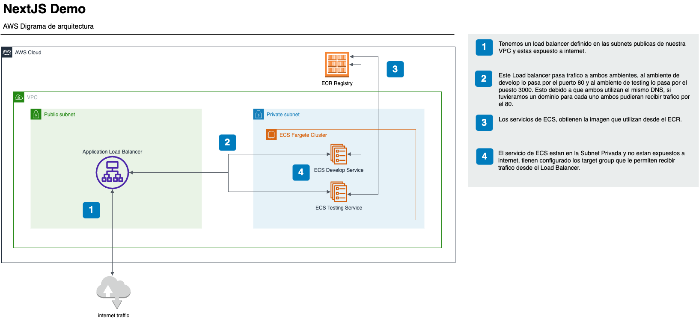

## Desarrollo de aplicación

Este es un proyecto [Next.js](https://nextjs.org/) creado con el comando [`create-next-app`](https://github.com/vercel/next.js/tree/canary/packages/create-next-app).

#### Con este comando se inicializo una aplicación sencilla de nextjs

```bash
npx create-next-app@latest nextjs-aws-ecs-deploy
```

#### Codigo agregado para mostrar el ambiente

Primero se agrego en el archivo next.config.mjs la configuración para agregar la variable en build time.

```typescript
const nextConfig = {
    env: {
      ENVIRONMENT_NAME: process.env.ENVIRONMENT_NAME
    }
};
```

Luego se agregaron las librerias necesarias importandolas

```typescript
import { useEffect, useState } from "react";
```

Luego se agrega el codigo para menejar el estado y el valor de la variable del environment que se va a estar mostrando en la app web

```typescript
const [environment, setEnvironment] = useState('');

useEffect(() => {
    setEnvironment(process.env.ENVIRONMENT_NAME || 'Unknown');
}, []);
```

Luego se agrega en el componente el codigo para mostrar la variable.

```typescript
<div className="fixed bottom-0 left-0 w-full p-6 text-center text-gray-800 dark:text-gray-200">
        Environment: {environment}
</div>
```

## Desarrollo de la infraestructura

La infraestructura se implemento toda bajo IaC. Se utilizaron [multiples modulos de terraform](https://registry.terraform.io/namespaces/terraform-aws-modules) para crear la infraestructura necesaria en AWS para desplegar la aplicación.

En el directorio de IaC veran multiples directorios donde esta definido los parametros con terragrunt y terraform.

- Se utilizo el [modulo de VPC](https://github.com/terraform-aws-modules/terraform-aws-vpc) para crear la VPC, subnets, NAT necesario para desplegar la aplicación en ECS.

- Se utilizo el [modulo de Load Balancer](https://github.com/terraform-aws-modules/terraform-aws-alb) para crear el Application Load Balancer que iba a exponer la aplicación a internet.

- Se utilizo el [modulo de ECR](https://github.com/terraform-aws-modules/terraform-aws-ecr) para crear los repositorios donde se van a subir y guardar las imagenes.

- Se utilizo el [modulo de ECS](https://github.com/terraform-aws-modules/terraform-aws-ecs/tree/master) para crear el cluster y dos servicios de ECS dentro del cluster, uno para el ambiente de develop y otro para el ambiente de testing.

Con el uso de estos modulos en conjunto con terragrunt se aplico la creación de la infraestructura necesaria.

Luego se agrego algo mas de infraestructura como codigo con Cloudformation para crear el rol y oidc provider que se conecta con github para que el workflow de github actions puede atenticarse con AWS.

### Crear infraestructura

Hay un script llamado apply.sh que pueden ver en el directorio IaC, al ejecutar este script se va a crear toda la infra necesaria para desplegar la aplicación.

#### Prerequisitos

- [Terragrunt](https://terragrunt.gruntwork.io/docs/getting-started/install/)
- [AWS CLI](https://docs.aws.amazon.com/cli/latest/userguide/getting-started-install.html)
- [Terraform](https://developer.hashicorp.com/terraform/tutorials/aws-get-started/install-cli)

```bash
chmod +x ./IaC/apply.sh
./IaC/apply.sh
```

> [!IMPORTANT]  
> Una vez ejecutado, los servicios de ECS no van a estar funcionales porque faltarian las imagenes que se construye con el pipeline, habria que correr los pipelines en cada rama, develop y testing para que cada ambiente funcione

## Definición del Pipeline

Para el despliegue se definio un workflow de Github Actions el cual tiene 3 Jobs:

- **setting-environment**: En este Job se crea una variable de ambiente para indicarle al pipeline hacia que ambiente va a ser el deploy.
- build-docker-image: En este Job se hace el build de la imagen, en el build de la imagen se le pasa un argumento `--build-arg ENVIRONMENT_NAME=${{needs.setting-environment.outputs.environment}}` que le indica en tiempo de construcción cual es la variable segun la rama. Se sube al ECR autenticando con AWS via OIDC (La recomendada y mas segura).
- **deploy-to-ecs**: Se utiliza actions que provee AWS para desplegar en ECS.
  - **aws-actions/amazon-ecs-render-task-definition**: Esta action se encarga de reescribir el task definition para colocar la nueva imagen del pipeline.
  - **aws-actions/amazon-ecs-deploy-task-definition@v1.5.0**: Esta action se encarga de hacer el deployment recibiendo como parametro el task definition.

Estos dos ultimos action utilizan los archivos .json que estan definidos en el directorio .github/workflows para hacer el cambio y desplegar la nueva imagen.

> [!IMPORTANT]  
> Antes de ejecutar el pipeline deben cambiar el valor del `role-to-assume` al que se creo con el script apply.sh para el action de `aws-actions/configure-aws-credentials@v4.0.1`

> [!IMPORTANT]  
> Se deben ajustar los parametros `image`, `taskRoleArn`, `executionRoleArn`  que se encuentra en los .json del directorio ./.github/workflows a la imagen generada por los repositorios de ECR que se crearon en el paso anterior. Estos parametros los pueden obtener yendo a la UI de AWS y copiando el .json del Definition Task generado por la IaC.

## Arquitectura de la solución



La solución tiene una arquitectura muy sencilla con las siguientes caracteristicas:

- Una VPC que tiene configurado 3 subnets publicas, 3 subnets privadas y una NAT asociada a las subnets privadas.

- Tiene un Application Load Balancer (ALB) que envia el trafico a ambos ambientes de ECS (develop y testing). Este Application Load Balancer esta creado en las subnets publicas. A este ALB tiene asociado dos target groups y dos listener para enviar trafico a los servios de ECS

- Hay un cluster de ECS con dos servicios desplegados **frontend-dev** y **frontend-testing**

- Para efectos del ejercicio se hicieron dos servicios de ECS el de dev respondera por el puerto 80 del DNS del load balancer y el de testing respondera por el puerto 3000.

- Hay dos repositorios de imagenes **frontend-ecr-dev** y **frontend-ecr-testing**

## Limpieza del ambiente

Hay un script en el directorio de IaC llamado destroy.sh que con aplicarlo debera eliminar toda la infraestructura creada.

```bash
chmod +x ./IaC/destroy.sh
./IaC/destroy.sh
```
